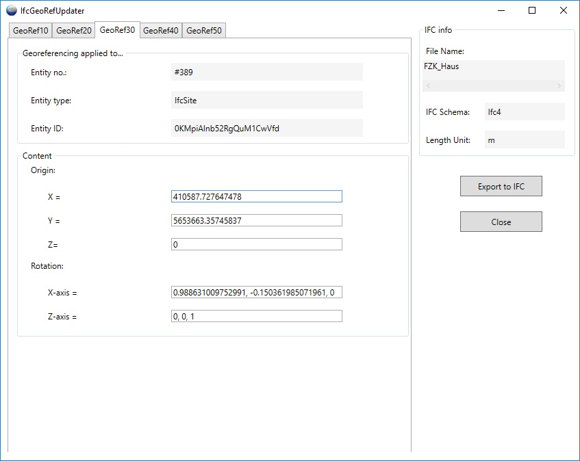

#  IFCGeoRefChecker-Dokumentation 

Dieses Dokument stellt ein neues Konzept für die Auswertung von gespeicherten Georeferenzierungsattributen in IFC-Dateien vor.  Außerdem wird in diesem Dokument die Funktionalität des vorgestellten  IFCGeoRefChecker-Tools beschrieben.

[TOC]

## Das -Level of Georeferencing- Konzept

Die Bereitstellung von Geodaten in einem BIM-Projekt ist eine wichtige Aufgabe für alle am BIM-Prozess beteiligten Personen. Attribute für Lage und Drehung in Richtung Norden sollten für weitere Projektschritte korrekt gespeichert werden. Das gängige offene Datenaustauschformat im Bereich BIM sind die Industry Foundation Classes (IFC). Es gibt einige in der offiziellen IFC-Dokumentation beschriebene Möglichkeiten, um Georeferenzierungsattribute in einer IFC-Datei zu speichern. Die offizielle IFC-Dokumentation und der Standard erlauben mehrere Wege, um georeferenzierende Attribute in einer IFC-Datei zu speichern.

Unser Konzept klassifiziert die verschiedenen Arten der Georeferenzierung in so genannte Levels of Georeferencing (LoGeoRef). 

Insgesamt stehen fünf Level (10, 20, 30, 40 und 50) zur Verfügung, die beschreiben, wie die Georeferenzierung eines Objekts vorgenommen werden kann. Je höher die LoGeoRef ist, desto mehr Qualität der Georeferenzierung kann von der bezeichneten Datei erwartet werden.  Es ist zu beachten, dass Informationen aus höheren Ebenen nicht automatisch Informationen aus niedrigeren Ebenen beinhalten und umgekehrt. Jede Ebene umfasst ihre eigenen IFC-Schema-Attribute und steht für sich.

Folglich kann eine IFC-Datei Bedingungen von mehr als einem "Level of GeoRef" erfüllen.

Die folgenden Unterabschnitte enthalten eine Erläuterung zu jedem "Level of GeoRef" und liefern den jeweiligen Auszug aus dem IFC-Schema, der für die Einordnung in den jeweiligen Level erfüllt sein muss.

###  LoGeoRef 10

Die einfachste Art zu beschreiben, wo sich ein Standort oder ein Gebäude befindet, ist das Hinzufügen einer Adresse zum BIM-Projekt. Vorteile sind die leichte menschliche Lesbarkeit und das einfache Verständnis einer solchen Adresse. Für Georeferenzierungszwecke ist sie nur ein grober Näherungswert für die Festlegung des Standorts oder des Gebäudes. Dennoch kann sie für die Integration von GIS-Daten hilfreich sein, wie z. B. das Hinzufügen von Daten der umliegenden Stadtmodelle.

Das IFC-Schema bietet eine Entität zur Speicherung von Adressdaten in einer IFC-Datei. Die Entität IfcPostalAddress enthält mehrere Attribute wie Adresszeilen, Postleitzahl, Ort, Region und Land. Für eine korrekte Zuordnung zu einem räumlichen Strukturelement muss das IfcPostalAddress-Objekt entweder von IfcSite oder IfcBuilding referenziert werden. Beide Entitäten enthalten ein bestimmtes Attribut für die Adressreferenzierung.

Zum besseren Verständnis sehen Sie sich bitte das folgende Klassendiagramm an:


Eine entsprechende IFC-Datei mit Erfüllung der "LoGeoRef10"-Bedingungen würde die folgenden Instanzen enthalten:


Die Datei enthält eine Instanz von IfcPostalAddress mit Informationen zur Georeferenzierung, die im grünen Rahmen hervorgehoben sind. In diesem Fall wird die Adresse von einer Instanz von IfcSite und einer Instanz von IfcBuilding referenziert (rote Rahmen). Bitte beachten Sie, dass zur Erfüllung von LoGeoRef 10 die IfcPostalAddress nicht in beiden Entitäten referenziert werden muss.

###  LoGeoRef 20

Es gibt eine weitere relativ einfache Möglichkeit zur Georeferenzierung von IFC-Dateien. Zur Einhaltung von LoGeoref 20 müssen Instanzen von IfcSite Werte für ihre Attribute RefLatitude und RefLongitude enthalten. Wie ihre Namen vermuten lassen, kann ein IFC-Modell eine einzelne Punktkoordinate mit geografischer Länge und Breite direkt in IfcSite speichern. Gemäß der IFC-Schemadefinition handelt es sich bei den Werten um geographische Koordinaten in Bezug auf das World Geodetic System (WGS84 mit EPSG:4326). Daneben ist es auch möglich, einen Wert für die Höhe im entsprechenden Attribut RefElevation zu speichern. Per Definition sollte RefElevation einen metrischen Wert haben, der sich auf ein lokal verwendetes Datum relativ zum Meeresspiegel bezieht. Es ist jedoch keine Standardmöglichkeit gegeben, den Namen des Datums explizit in die Datei zu schreiben. Dies gilt auch für die geographische Breite und Länge mit ihrer Verwendung von WGS84.

Zum besseren Verständnis sehen Sie sich bitte das folgende Klassendiagramm an:


Die entsprechende IFC-Datei muss nur eine Instanz von IfcSite mit den Attributen RefLatitude / RefLongitude und RefElevation enthalten.


Breitengrad und Längengrad werden als durch Kommata getrennte Ganzzahlen gespeichert, die die Bedingungen des IFC-Typs IfcCompoundPlaneAngleMeasure erfüllen. Es können drei oder vier Ganzzahlen sein, die den gewünschten Winkel beschreiben. Der erste Wert steht für den Grad, der zweite für die Minuten, der dritte für die Sekunden und der optionale vierte für den Millionstel-Sekundenanteil des Winkels. Dies zeigt, dass es möglich ist, eine Punktkoordinate für IfcSite auf eine sehr genaue Weise zu setzen. LoGeoRef20 enthält allerdings keine Möglichkeiten, etwaige Rotationsparameter zu speichern.

###  LoGeoRef 30

Dieses Level beschreibt die Möglichkeit, den Standort eines beliebigen IfcSpatialStructureElements direkt in seinem LocalPlacement-Objekt zu speichern. Unterklassen, die in einer IFC-Datei instanziiert werden können, sind IfcSite, IfcBuilding, IfcBuildingStorey oder IfcSpace. Als wichtige Einschränkung gilt, dass dieses Level nur für solche Raumstrukturelemente gilt, die keine relative Platzierung zu einem anderen Raumstrukturelement haben. Daher sollte das Attribut PlacmentRelTo des IfcLocalPlacement-Objekts, das zum IfcSpatialStructureElement gehört, leer sein. In der Regel ist dies das gleiche räumliche Element, das auch das oberste Element in der räumlichen Hierarchie ist. Nach der IFC-Schemadefinition sollte dies immer ein IfcSite-Objekt sein.

Da das Attribut RelativePlacement vom Typ IfcAxis2Placement3D ist, gibt es Möglichkeiten, X-, Y- und Z-Koordinaten für den Standort und Vektorkomponenten für eine Winkelangabe für eine Drehung der X-Achse und der Z-Achse zu speichern.

Damit ist es möglich, sowohl georeferenzierte Koordinaten im Attribut Location zu speichern, die metrische Werte in einem beliebigen Koordinatenreferenzsystem angeben, als auch beliebige Rotationswerte über das Setzen der Vektorkomponenten des spezifischen Attributs Axis bzw. RefDirection zu speichern.

Zum besseren Verständnis sehen Sie sich bitte das folgende Klassendiagramm an:


Eine entsprechende IFC-Datei enthält die folgenden Instanzen, um dieses Level zu erfüllen:


Das obige Beispiel enthält die Definitionen für ein IfcSite-Objekt, das durch einen in IfcCartesianPoint gespeicherten Standort georeferenziert wird. Die Datei wendet auch Werte für eine Rotation der X-Achse an (#69184). Es gibt keine Rotation der Z-Achse, aber dennoch muss die Standardrichtung in einer IfcDirection-Instanz gespeichert werden (#69183). Bitte beachten Sie, dass auch dieses Level keine Information darüber enthält, ob die gespeicherte Lage und Drehung lokal oder bezogen auf ein globales Koordinatenreferenzsystem ist.

###  LoGeoRef 40

Dieses Level bietet zwei Hauptattribute zur Speicherung von Georeferenzierungsattributen in einer IFC-Datei. Sowohl WolrdCoordinateSystem als auch TrueNorth sind Teil des IfcGeometricRepresentationContext eines instanziierten IfcProjects. Gemäß der IFC-Schemadefinition enthält jede IFC-Datei ein IfcProject und auch einen referenzierten IfcGeometricRepresentationContext mit dem Attribut ContextType, das als "Model" angegeben ist. 

Es ist auch möglich, ein Koordinatensystem für den 3D-Modellkontext des Projekts über das Attribut WorldCoordinateSystem einzurichten. 

Die anderen Attribute folgen der gleichen Regel wie in der vorherigen LoGeoRef 30 erwähnt. Ein Standort, der in einer Instanz von IfcCartesianPoint gespeichert wird, und optionale Richtungen für die X- und Z-Achse, die in Instanzen von IfcDirection gespeichert werden.

Als zweites Hauptattribut gibt es das TrueNorth-Attribut. Dieses Attribut wird für den Fall verwendet, dass die Y-Achse des angegebenen WorldCoordinateSystems nicht auf den globalen Nordpol zeigt. Das bedeutet, dass dies eine weitere Möglichkeit ist, eine Rotation für die XY-Ebene festzulegen. Das hat zur Folge, dass die entsprechende IfcDirection nur zwei Vektorkomponenten speichern kann.

Zum besseren Verständnis sehen Sie sich bitte das folgende Klassendiagramm an:


IFC-Dateien mit Instanzen welche oben genannt wurden könnten wie folgt aussehen:


Im Beispiel enthält der IfcGeometricRepresentationContext einen georeferenzierten Standort in IfcCartesianPoint. Seine Richtungen sind optional und nicht explizit angegeben. Das heißt, es werden die Standardrichtungen für X-Achse (1/0/0) und Z-Achse (0/0/1) verwendet. Zusätzlich wird in IfcDirection (#91) eine Drehung in Richtung der XY-Ebene angegeben.

Das Beispiel zeigt die Möglichkeit, georeferenzierte Koordinaten und Drehungen für den gesamten Projektkontext und nicht nur für ein bestimmtes (räumliches) Element zu speichern. Außerdem bietet das TrueNorth-Attribut die Möglichkeit, eine Verzerrung direkt relativ zur Nordrichtung zu setzen.

Diese Optionen könnten jedoch verwirrend und redundant sein, wenn die Richtungsattribute auf WorldCoordinateSystem und TrueNorth gesetzt sind.

###  LoGeoRef 50

Dieses Level bietet die höchste Qualität hinsichtlich der Georeferenzierung einer IFC-Datei. Sie ist erst in IFC-Dateien ab IFC-Schema Version 4 verfügbar. Es ist also wichtig zu beachten, dass keine IFC-Datei vor IFC4 diesem Level entsprechen kann.

Mit dem IFC-Schema Version 4 hat buildingSMART einige Entitäten speziell für Georeferenzierungszwecke eingeführt. Insbesondere gibt es eine Klasse namens IfcMapConversion, in der der Offset zwischen Projektkoordinatensystem und dem globalen Ursprung eines Koordinatenreferenzsystems in den Attributen Eastings, Northings und OrthogonalHeight für die globale Höhe gespeichert werden soll. Die Rotation für die XY-Ebene wird in den Attributen XAxisAbscissa und XAxisOrdinate gespeichert. Jedes Attribut speichert eine Vektorkomponente des resultierenden Winkels (im Gegensatz zum Attribut TrueNorth mit beiden Vektorkomponenten, siehe LoGeoRef 40). Mit dem Attribut Scale kann eine Verzerrung von Distanzen eingeführt werden.

Die Verbindung zum Projekt wird über das Attribut SourceCRS hergestellt, das von IfcCoordinateOperation geerbt wurde. Als Randbedingung dieses Levels muss SourceCRS vom Typ IfcGeomtricRepresentationContext sein. TargetCRS ist folglich das Koordinatenreferenzsystem, das für das Projekt gelten soll. Zur Beschreibung dieser Systeme ist IFC4 in der Lage, Daten bezüglich des CRS über eine Instanz von IfcProjectedCRS zu speichern. Per Schemadefinition wird empfohlen, das CRS mit einem EPSG-Code anzugeben. Es kann aber auch über die anderen Attribute dieser Entität angegeben werden.

Zum besseren Verständnis sehen Sie sich bitte das folgende Klassendiagramm an:


Eine entsprechende IFC-Datei der Schema-Version 4 enthält die folgenden Instanzen zur Erfüllung des LoGeoRef50:


Die Beispieldatei zeigt, dass dieser Level keine Placement-Entities benötigt, sondern zusätzliche Entities für die Georeferenzierung verwendet. So ist es möglich, Konvertierungen zwischen einem lokalen Bezugssystem und einem Koordinatenreferenzsystem durchzuführen.

## Das -IFCGeoRefChecker- Tool (Version: 0.3.0.0)

Diese Anwendung dient als einfaches Prüftool für das oben dargestellte LoGeoRef-Konzept. Es ist in C# unter Verwendung des .NET Framework 4.6 geschrieben.

### Historie /Changelog

- Überarbeitung der IfcGeoRefUpdater-Funktionalität
-- einfachere Handhabung (keine tieferen IFC-Kenntnisse mehr erforderlich)
-- Möglichkeit zur Positionierung des Gebäudeperimiters im Kartenkontext (Alpha-Status)
- kleinere Änderungen (Arbeitsverzeichnis setzen, Struktur der Json-Datei)


Das Tool ist in der Lage, alle Attribute mit Georeferenzierungsinhalten in der gewählten IFC-Datei zu lesen und zu prüfen.
Es wird empfohlen, das Arbeitsverzeichnis zunächst auf ein Verzeichnis zu setzen, in dem Sie die Berechtigung zum Schreiben und Löschen von Dateien haben. Das Checker-Tool benötigt diese Berechtigungen für die volle Funktionalität.

Die Anwendung ist in der Lage, mehr als eine IFC-Datei in einer Aktion zu prüfen. Über den Klick auf "IFC-Dateien prüfen..." müssen Sie im Dateidialog die Datei(en) auswählen, die gegen das LoGeoRef geprüft werden sollen. Wenn Sie eine Protokolldatei in Ihr Arbeitsverzeichnis exportieren möchten, setzen Sie vor dem Importieren/Prüfen einfach den Haken bei "Protokolldatei exportieren".

Je nach Größe der Datei(en) kann der Importvorgang einige Zeit in Anspruch nehmen. Wenn die Dateien erfolgreich geladen wurden, erscheinen die Namen der Eingabedateien in der Liste unter dem Gruppenfeld "Statusbericht". Außerdem gibt es eine Statusanzeige für den Import, die die Anzahl der importierten IfcModelle anzeigt.

**Die Prüfergebnisse werden wie folgt angezeigt:**
- Bereich "GeoRefCheck Überblick": Kurzresultate als Wahr- oder Falsch-Entscheidung bezüglich des LoGeoRef-Konzepts (siehe oben)
- wenn angehakt (Standard): detaillierte Ergebnisse in Protokolldatei (im Dateisystem und auch über Klick auf "See log file" Button erreichbar)
- wenn angehakt: detaillierte Ergebnisse in JSON-Datei (im Dateisystem und auch über Klick auf Schaltfläche "Siehe JSON-Datei" erreichbar)


Wenn die Anwendung eine bestimmte Datei nicht importieren kann, wird eine Fehlermeldung mit der Begründung angezeigt, warum sie nicht importiert werden kann. In diesem Fall sollten Sie die Syntax der Datei mit einem geeigneten IFC-Dateiprüfer überprüfen.

Das Programmfenster könnte nach der Prüfung wie folgt aussehen:


### Aufbau der resultierenden Protokolldatei

Jede Protokolldatei beginnt mit einem Titel mit dem Namen der geprüften IFC-Datei und Datum / Uhrzeit in Klammern.

```

Examination of "Projekt.ifc" regarding georeferencing content (04/16/2018, 14:19:40)
--------------------------------------------------------------------------------------
--------------------------------------------------------------------------------------

```

In den nächsten Abschnitten werden nacheinander die Ergebnisse der einzelnen LoGeoRef-Prüfungen vorgestellt.

##### LoGeoRef10 Ergebnisse

Die Logdatei enthält die Prüfergebnisse für alle möglichen Adressen, die von IfcSite oder IfcBuilding referenziert werden. Damit ist es möglich, alle Site- und Building-Objekte hinsichtlich ihres Adressattributs auszuwerten. Einige positive Ergebnisse für die LoGeoRef 10-Prüfung sehen wie folgt aus:
```

Existing addresses referenced by IfcSite or IfcBuilding
----------------------------------------------------------
Found address referenced by #110=IfcBuilding:
 #106= IfcPostalAddress
  Address: Reichenbachstrasse 1
  Postal code: 01069
  Town: Dresden
  Region: Saxony
  Country: Germany

LoGeoRef 10 = True

```
Das obige Beispiel zeigt eine optimal ausgefüllte IfcPostalAddress-Instanz (deutsches Beispiel) der untersuchten Datei. Bitte beachten Sie, dass dieses Tool den Inhalt nicht auf seine Plausibilität hin überprüft. Es ist auch möglich, dass die Adressinformationen unvollständig sind, verursacht durch die exportierende Software oder unvollständige Angaben durch den Benutzer der exportierenden BIM-Software.

Das Ergebnis der Prüfung wird wahr sein, wenn es eine IfcPostalAddress gibt, die von IfcSite oder IfcBuilding referenziert wird. Dies kann wie im Beispiel umfassend sein, aber auch sehr vage, wenn beispielsweise nur das Land angegeben wird.

##### LoGeoRef20 Ergebnisse

Positive Ergebnisse für das festgestellte Level LoGeoRef 20 würden so aussehen:

```

Geographic coordinates referenced by IfcSite (Latitude / Longitude / Elevation)
--------------------------------------------------------------------------------

 Referenced in #445= IfcSite
  Latitude: 51.0339851377778
  Longitude: 13.7339153288889
  Elevation: 115.1

LoGeoRef 20 = True

```
Das Ergebnis der Prüfung ist wahr, wenn ein IfcSite-Objekt in der IFC-Datei vorhanden ist, das Attributwerte für RefLatitude und RefLongitude enthält. Folglich muss die Höhe für ein wahres Prüfergebnis nicht angegeben werden, sondern wird vom Prüfwerkzeug gelesen.

Eine Aussage über die Einheiten der geschriebenen Werte gibt es nicht, da das IFC-Schema diese Einheiten in seiner Dokumentation nur implizit regelt. Normalerweise sollten Latitude und Longitude geografische Koordinaten nach WGS84 mit der Einheit Grad sein. Die Höhe sollte einen metrischen Wert haben, der sich auf einen lokal verwendeten Bezugspunkt relativ zum Level bezieht.

Die Gültigkeit dieser Vorschriften für die jeweilige IFC-Datei kann von diesem Checker nicht garantiert werden, daher werden die Einheiten hier nicht erwähnt.

##### LoGeoRef30 Ergebnisse

Das Ergebnis der Prüfung auf das Level LoGeoRef 30 könnte wie das folgende Beispiel aussehen:

```

Local placement for the uppermost IfcSpatialStructureElement (usually an instance of IfcSite)

The placement of those elements is only relative to the WorldCoordinateSystem (see LoGeoRef 40) but not to other IFC-Elements
-------------------------------------------------------------------------------------------------------------------------
  Referencing Element: #9094= IfcSite
  Placement referenced in #83= IfcAxis2Placement3D
   X = 0
   Y = 0
   Z = 0
  Rotation X-axis = (1/0/0)
  Rotation Z-axis = (0/0/1)

  LoGeoRef 30 = False

 Referencing Element:#77324=IfcVirtualElement
 Placement referenced in #77322=IfcAxis2Placement3D
  X = 71.29499998465
  Y = 4.01
  Z = 0
 Rotation X-axis = (-8/-50/0)
 Rotation Z-axis = (0/0/1)

 LoGeoRef 30 = True

```
Dieses Beispiel zeigt ein mögliches Ergebnis der LoGeoRef 30-Prüfung. Zunächst werden bei der Prüfung alle Elemente in der IFC-Datei ermittelt, die keine Platzierung relativ zur Platzierung eines anderen Elements haben.

Wenn neben den im ersten Schritt gefundenen Raumstrukturelementen noch weitere Elemente vorhanden sind, erscheinen diese ebenfalls in der Protokolldatei (z.B. #177012= IfcVirtualElement). Es ist wichtig, diese Elemente zu berücksichtigen, wenn die absolute Platzierung, z.B. für IfcSite, nachträglich geändert wird. Um die relative Positionierung der genannten Elemente zueinander zu gewährleisten, ist es daher notwendig, die anderen Elemente, die LoGeoref30 füllen, mit dem gleichen Wert zu versehen.

Wie Sie sehen können, wird das LoGeoRef-Ergebnis für IfcSite im Beispiel False. Per Definition ist das Ergebnis nur dann wahr, wenn eine der Komponenten der gespeicherten Koordinaten in IfcAxis2Placement3D größer als Null ist. Natürlich macht eine Komponente größer als Null die Datei nicht automatisch zu einer georeferenzierten, aber dies ist ein erster Indikator dafür, dass es eine Georeferenzierung für diesen Level geben könnte. Eindeutige Aussagen könnten von Anwendern nur durch eine kritische Betrachtung der gespeicherten Werte gemacht werden.

##### LoGeoRef 40 Ergebnisse

Beispiel für das Ergebnis der Prüfung nach LoGeoRef 40:

```
Project context attributes for georeferencing (Location: WorldCoordinateSystem / Rotation: TrueNorth)
-------------------------------------------------------------------------------------------------------
 
 Project Context element: #62= IfcGeometricRepresentationContext
  Placement referenced in #59= IfcAxis2Placement3D
   X = 0
   Y = 0
   Z = 0
  Rotation X-axis = (1/0/0)
  Rotation Z-axis = (0/0/1)

 TrueNorth referenced in #60 = IfcDirection
   X-component = -0.537299608347
   Y-component = -0.843391445813

LoGeoRef 40 = False

```

Diese Prüfung widmet sich der Untersuchung des WordlCoordinateSystem und der TrueNorth-Attribute des Projektmodellkontextes in einer IFC-Datei. Zunächst sucht das Tool das obligatorische IfcGeometricRepresentationContext-Objekt mit dem Typ "Model" in der Datei heraus. Dieser Kontext legt das Koordinatensystem der Modellansicht eines Projekts fest. Seine Lage wird im Platzierungsobjekt des WorldCoordinateSystems gespeichert. Ähnlich wie im vorherigen Level wird dieses Koordinatensystem über X,Y und Z als Lage und optional mit Rotation der X- und Z-Achse eingerichtet.

Zusätzlich wertet das Tool die Werte im Attribut TrueNorth aus, um zu prüfen, ob eine Rotation der XY-Ebene in Richtung TrueNorth vorliegt.

Enthält das Logfile ein zweites Objekt für LoGeoRef40, so ist dies ein optional geschriebener Kontext für die Draufsicht des Projektes. Wenn die Werte geändert werden, sollten beide Objekte die gleichen Werte erhalten.

Bitte beachten Sie, dass der Ergebniswert nur dann wahr ist, wenn eine der Ortskoordinatenkomponenten wieder größer als Null ist. Die Gründe dafür sind ähnlich wie bei den Aussagen im vorherigen Level.  

##### LoGeoRef 50 Ergebnisse

Die positiven Ergebnisse auf eine LoGeoRef 50-Prüfung sehen wie folgt aus:

```
Specific entities for georeferencing (only in scope of IFC4; IfcMapConversion references IfcGeometricRepresenationContext)
-------------------------------------------------------------------------------------------------------------------------
 Project Context element which is referenced by IfcMapConversion: #100011= IfcGeometricRepresentationContext
 
 MapConversion element: #79141=IfcMapConversion
  Translation:
  Translation Eastings: 3458715.92
  Translation Northings: 5439966.65
  Translation Height: 113.7
  Rotation X-axis (Abscissa): 0.270600445976
  Rotation X-axis (Ordinate): 0.962691746426
  Scale: 1
  
 CRS element: #79139=IfcProjectedCRS
  Name: EPSG:31467
  Description: DHDN / 3-Degree Gauss-Krueger Zone 3
  Geodetic Datum: ETRS89
  Vertical Datum: 
  Projection Name: Gaus-Krueger
  Projection Zone: 3

LoGeoRef 50 = True

```
Das Beispiel zeigt die Ausgabe, wenn eine IfcMapConversion auf die untersuchte IFC-Datei angewendet wird. Bitte beachten Sie, dass dieser Level nur zutreffend sein kann, wenn Sie eine IFC-Datei prüfen, welche nach IFC-Schema Version 4 oder später geschrieben wurde. Das Prüfwerkzeug sucht in der Datei nach einem Element von IfcMapConversion. Als zweite Einschränkung für ein wahres Ergebnis müssen dessen Quell- und Zielattribute die Bedingungen von LoGeoref 50 erfüllen (siehe das UML-Diagramm im Konzeptteil).

Bitte beachten Sie, dass die Gültigkeit der geschriebenen Daten in der Verantwortung des Anwenders bzw. der exportierenden BIM-Software liegt, die für den Export von IFC-Dateien verwendet wird.

### Aufbau der resultierenden JSON-Datei

Als Möglichkeit, die GeoRef-Daten in einer maschinenlesbaren Form außerhalb der spezifischen IFC-Datei zu speichern, bietet die Anwendung einen Export im JSON-Format. Der Stil einer resultierenden JSON-Datei ist der oben beschriebenen Protokolldatei sehr ähnlich.

Jeder JSON-GeoRef-Export enthält ein Gesamtobjekt mit initialen Attributen für die Zuordnung zu dem spezifischen Projekt in der IFC-Datei, die die Quelle der GeoRef-Daten war. So gibt es Attribute mit Werten für die GlobalID der IfcProject-Instanz und Datums-/Zeitwerte, die das Erstellungsdatum der zugeordneten IFC-Datei und den Zeitpunkt der Prüfung der IFC-Datei durch diese Anwendung anzeigen. Zur besseren Interpretation der GeoRef-Daten wird in der JSON-Datei auch die IfcSchemaVersion gespeichert.

Unterhalb dieses Teils befinden sich Attribute für jedes GeoRef-Level . Die Daten des jeweiligen GeoRef-Objektes werden in einem Array gespeichert. Für jedes Level kann es mehr als einen Wert geben, z. B. wenn mehr als eine referenzierte Adresse gefunden wurde. 

```Json
{
  "GlobalID": "344O7vICcwH8qAEnwJDjSU",
  "IFCSchema": "Ifc4",
  "TimeCreation": "2018-02-12T12:36:08",
  "TimeCheck": "2018-08-28T12:02:03",
  "LengthUnit": "m",
    "LoGeoRef10": [ {} ],
    "LoGeoRef20": [
    {
      "GeoRef20": true,
      "Instance_Object": [
        "#101",
        "IfcSite"
      ],
      "Latitude": 52.15,
      "Longitude": 5.3833333333333337,
      "Elevation": 20.0
    }
  ],

```

Jeder Level-Wert enthält die vom IfcGeoRefChecker bereitgestellten Daten. Auf die Daten kann man zugreifen, indem man zunächst die Arrays des jeweiligen Levels in einer Schleife durchläuft. Da es mehr als einen Wert pro Level geben kann, speichert jedes Level-Objekt auch Daten für Referenz- und Instanzobjekt. Diese Werte enthalten Daten zur Identifizierung der Entitäten in der zugehörigen IFC-Datei. Sie sind die Nummer jeder IFC-Instanz zusammen mit dem Hash-Symbol, wie es in der IFC-Datei gespeichert ist, z.B. "#114". Als zweiten Wert enthalten Referenz- und Instanzobjekt auch den Typ des IfcObjects, z. B. "IfcSite". Referenzobjekte sind immer Objekte mit einer eigenen IfcGloballyID. Für dieses Objekt gelten bestimmte GeoRef-Werte. Instanzobjekte sind Ifc-Instanzen, die entweder die gespeicherten Daten direkt enthalten oder auf einem tieferen Level in der Datei referenzieren. Bitte beachten Sie, dass eine exportierte JSON-Datei auch GeoRef-Objekte enthält, die keine Daten enthalten. In diesem Fall existiert zwar ein Referenzobjekt, aber kein Instanzobjekt mit IFC-Hashnummer. Oft sind Georef-Daten nicht vollständig in einer IFC-Datei gespeichert. Die resultierende JSON-Datei enthält für diese Elemente entweder "n/a" für String-Objekte oder den Phantasiewert "-999999" für Double-Werte.

### GeoRefUpdate Funktionsweise

Als Haupterweiterung der IfcGeoRefChecker-Funktionalität bietet diese Anwendung die Möglichkeit, GeoRef-Daten in der IFC-Datei zu ändern.
Es gibt zwei Hauptmöglichkeiten, die Georeferenzierung für Ihre IFC-Datei zu aktualisieren. Sie können sie im Bereich "Update/change GeoRef" erreichen.

#### Erste Variante: via Manuelle Eingabe

Sie können Ihre Datei manuell aktualisieren. Das bedeutet, dass Sie die gewünschten Attribute über eine Textfeld-Eingabe einstellen.
Durch Klicken auf "...über manuelles Setup" erscheint ein Fenster für die Eingabe der Daten:


Es sind keine IFC-Kenntnisse erforderlich. Sie haben die Möglichkeit, lediglich die "Postalische Adresse" zu aktualisieren, eine grobe Georeferenzierung über "Geografische Standortkoordinaten" einzustellen oder eine "Projektierte Transformation" mit Translation und Rotation sowie die Definition des Koordinatenreferenzsystems per EPSG-Code zu definieren.
Abhängig von den späteren Exporteinstellungen definieren die Transformationsparameter normalerweise die Transformation zwischen Ihrem lokalen BIM/CAD-Koordinatensystem und dem geodätischen (oder lokalen) Koordinatenreferenzsystem am Projektbasispunkt.

Durch Klick auf "Speichern und Schließen" wird die Eingabe intern für den späteren IFC-Export gespeichert.
Mit Klick auf "Berechnen" wird die "Projizierte Transformation" berechnet, wenn die Position und Drehung in "Geographische Standortkoordinaten" angegeben und angehakt ist, oder umgekehrt. Beachten Sie, dass diese automatische Berechnung nur die UTM-Projektion in ihrer projizierten Transformation unterstützt.

#### Zweite Variante: via Browser-Karte

Der Vorgang wird durch Klick auf die Schaltfläche "...via Browser-Karte" gestartet.

Der IfcGeorefChecker berechnet zunächst den Gebäudeumfang aus der Wandgeometrie Ihres IFC-Modells. Bitte beachten Sie, dass die Speicherung der Geometrie in IFC eine große Bandbreite an Möglichkeiten bietet. Daher kann es möglich sein, dass die Berechnung fehlschlägt. Bitte kontaktieren Sie uns, wenn dies der Fall sein sollte!

Nach der Berechnung werden die Gebäudeumrisse in eine json-Datei geschrieben, die Sie an einem bekannten Ort in Ihrem Dateisystem speichern sollten.

Der nächste Schritt findet extern in Ihrem lokal präferierten Browser statt. Die Browser-Anwendung "Building Locator" wird automatisch geladen. Bitte stellen Sie sicher, dass Sie mit dem Internet verbunden sind.


Der Building Locator ermöglicht es uns, den Georef-Level Ihres Gebäudes zu ändern. Sie sind nun in der Lage, das Gebäude im Browserfenster zu übersetzen und zu rotieren. Außerdem können Sie die postalische Adresse an der gewählten Position automatisch oder per Texteingabe ermitteln lassen.
Bitte folgen Sie den angezeigten Schritten.

Als Ergebnis erhalten Sie eine neue json-Datei mit den aktualisierten Georeferenzierungsattributen. Diese Datei ist die Basis für den nächsten Schritt im IfcGeoRefChecker.

### Änderungen in IFC exportieren

Nachdem Sie die Georeferenzierungsattribute über die Karte oder manuell aktualisiert haben, müssen Sie diese in eine neue IFC-Datei exportieren.

Über den Klick auf "Export Updates to IFC" müssen Sie die aktualisierte georef json Datei importieren, die Sie im Schritt zuvor gespeichert haben.

Danach wird ein Fenster mit einigen Optionen für den IFC-Export geöffnet. Aufgrund des unterschiedlichen Verständnisses von Georeferenzierung und auch der unterschiedlichen IFC-Schema-Versionen ist es unabdingbar, einige Exporteinstellungen für Ihren Export zu wählen.

Das Exportfenster sieht wie folgt aus:


Mit den Standardeinstellungen exportiert die Anwendung Georeferenzierungsattribute, wie sie der neueste IFC-Standard verlangt. Leider ist nicht jede BIM-Software in der Lage, diese Attribute aus der IFC-Datei zu lesen. 
Wir empfehlen Ihnen, die verschiedenen Optionen zu testen und die resultierenden Dateien in Ihre BIM-Umgebung zu importieren, um herauszufinden, welche Option Ihren Anforderungen am besten entspricht. 

Neben der Exportart ist es auch möglich, Einstellungen zum Adressenexport (nur Gebäude oder Gelände/Gebäude) vorzunehmen und eine Höhenreferenz einzugeben (falls nicht vorher angegeben).

Wenn Sie fertig sind, können Sie die Daten über die Schaltfläche "Export to IFC" nach IFC exportieren.

### Erweiterter Export nach IFC (nur für IFC-Experten empfohlen)

Letztlich gibt es noch eine weitere Funktionalität, um den Georeferenzierungsexport nach IFC auf direktere Weise zu beeinflussen. 
Über einen Klick auf "IFC bearbeiten" erscheint ein Fenster, in dem Sie die Georeferenzierungsattribute bezüglich ihrer IFC-Entitäten ändern können. Das Fenster ähnelt der Update-Funktionalität in der letzten IfcGeoRefChecker-Version und sollte nur verwendet werden, wenn Sie mit dem IFC-Schema vertraut sind.



Die GUI enthält Registerkarten für jedes GeoRef-Level. Jede Registerkarte ist auf ähnliche Weise aufgebaut. Es gibt immer Groupboxen für "Georeferenzierung angewendet auf..." und "Inhalt". Die erste Groupbox enthält die Instanz, auf die sich die spezifischen Georeferenzierungsattribute in der Groupbox "Content" beziehen.

Wenn Sie fertig sind, können Sie die Daten über die Schaltfläche "Export to IFC" nach IFC exportieren. 


#### Weitere Hinweise

- In der resultierenden IFC werden alte Instanz-Entitäten nicht gelöscht, aber ihre Referenz wird auf die neue Instanz gesetzt. Der Grund dafür ist, dass es nicht ausgeschlossen werden kann, dass z. B. ein kartesischer Punkt von einer anderen Entität ohne Georeferenzierung referenziert wird, z. B. bei Geometrie-Entitäten.


#### Beste Vorgehensweise

#### Beste Vorgehensweise

In der Praxis kann es zu Missverständnissen darüber kommen, welche Attribute bei der Georeferenzierung möglich sind. Das Level of Georeferencing Konzept beschreibt diese Möglichkeiten. Eine korrekte Verwendung nach dem IFC-Schema mit Level 40 oder Level 50 Attributen bedeutet leider nicht automatisch, dass jede BIM-Software diese Daten korrekt interpretiert.

Daher kann der IfcGeoRefUpdater keine Garantie für die korrekte Interpretation in verschiedenen Softwareprodukten übernehmen. Einige Tests haben gezeigt, dass die Georeferenzierung von IFC-Dateien von Software unterschiedlich gehandhabt wird. In Hochbausoftware wird häufig die Standortbestimmung nach Level 30 zum Zweck der globalen metrischen Koordinaten verwendet. Eine allgemeingültige Aussage dazu lässt sich jedoch nicht ableiten. Jeder Anwender ist selbst dafür verantwortlich, das Update-Tool richtig einzusetzen.

Dennoch sollen hier einige Hinweise gegeben werden:

1. Exportieren Sie eine IFC-Datei aus Ihrer BIM-Software, von der Sie wissen, dass das Projekt für Ihren Zweck korrekt georeferenziert ist.
2. Prüfen Sie die Georeferenzierung der resultierenden IFC-Datei mit IfcGeoRefChecker. Jetzt können Sie sehen, welche GeoRef-Attribute von Ihrer exportierenden Software verwendet werden.
3. Für zukünftige Projekte sollten Sie nur die Attribute ausfüllen oder aktualisieren, wenn Sie das bestimmte IFC-Modell in Ihrer BIM-Software verwenden werden.

Dies kann auch hilfreich sein, wenn Sie eine IFC-Datei erhalten, die von einer anderen BIM-Software exportiert wird, die dann wiederum andere Georeferenzierungsattribute verwendet. Der IfcGeoRefUpdater hilft Ihnen, die Attribute für Ihre Software zu ändern.

Einige Anmerkungen zu unterschiedlicher Software:

##### Revit:
Wenn Sie die Ifc-Daten mit korrekten Koordinaten in Revit verwenden möchten, ist es wichtig, den "Projektbasispunkt" an der gewünschten Stelle zu platzieren (entspricht der LoGeoRef30-Position von IfcSite), bevor Sie die generierte Ifc-Datei in Revit importieren. Revit interpretiert derzeit nicht die Eigenschaft IfcMapConversion (LoGeoRef50).

##### Solibri:
Kostenlose Solibri-Softwarelösungen (Solibri Model Viewer / Solibri Anywhere) importieren in der Regel fast alle IFC-Informationen nach LoGeoRef 10 bis LoGeoRef30 korrekt in ihre Standortinformationen.

### GeoRefComparer

Das Vergleichswerkzeug ist eine weitere Erweiterung des IfcGeoRefCheckers. Es bietet die Funktionalität, ein Bündel von IFC-Dateien mit einer Haupt-/Referenz-IFC-Datei hinsichtlich ihres georeferenzierten Inhalts zu vergleichen.


Bitte beachten Sie, dass der Comparer mindestens zwei importierte Ifc-Dateien in der Liste im Hauptfenster (IfcGeoRefChecker) benötigt.

#### Vorgeschlagene Methode zum Vergleich der Georeferenzierung

1. (Importieren Sie mindestens 2 IFC-Dateien im Hauptfenster)
2. Starten Sie IfcGeoRefComparer durch Klicken auf die entsprechende Schaltfläche im IfcGeorefChecker-Fenster
3. Wählen Sie das Referenzmodell in der Combobox
4. Wählen Sie die Modelle, die mit dem Referenzmodell verglichen werden sollen
5. Klicken Sie auf "StartComparison" 

#### Aktuelle Einschränkungen

Der Comparer unterstützt derzeit keine mehrdimensionalen Daten auf  GeoRef-Level. Das bedeutet, dass auf Level 10, 20 und 30 nur ein IfcSite-Objekt untersucht wird. Die Gebäude werden nur hinsichtlich ihrer Adresse verglichen. Auf Level 40 und 50 wird nur der IfcGeometricRepresentationContext der Modellansicht (3D-Ansicht) verglichen.
Die genannten Einschränkungen sollten die meisten IFC-Dateien nicht negativ beeinflussen.


#### Ergebnis


Als Ergebnis des Vergleichs schreibt die Anwendung automatisch ein Logfile in das Verzeichnis des Referenzmodells. Diese Logdatei enthält kurze Aussagen über das Ergebnis des Vergleichs zwischen dem Referenzmodell und jedem ausgewählten anderen Modell. Wenn die Georeferenzierung nicht gleich ist, gibt es einen Hinweis, bei welchem Level ein Unterschied festgestellt wurde.

Siehe Beispiel:

```
Results of Comparison regarding Georeferencing for reference model: Haus_1.ifc

Comparison to SampleHouse.ifc_edit.ifc:
 The georeferencing of the files is NOT equal.
  A difference was detected at GeoRef20 (IfcSite Lat/Lon/Elevation) 
  A difference was detected at GeoRef30 (IfcSite Placement) 
  A difference was detected at GeoRef40 (IfcProject WCS/True North) 

Comparison to Haus_1_TGA.ifc:
 The georeferencing of the files is exactly equal.

```
### IFC-Dateien mit Kommandozeilenargumenten prüfen

Alternativ zur grafischen Benutzeroberfläche ist es möglich, das IFCGeoRefCheckerCommand.exe zu verwenden, um den Level der Georeferenzierung mehrerer IFC-Dateien auf einmal zu prüfen (und Log- oder Json-Dateien zu erzeugen, die die Ergebnisse anzeigen).
Dazu wird eine *.json-Datei benötigt, die den Dateipfad und -namen der zu prüfenden IFC-Dateien, einen Ausgabepfad und die Information, ob Log- und/oder json-Ergebnisdateien erzeugt werden sollen, enthält.
Eine solche json-Eingabedatei könnte wie folgt aussehen:

```
{
  "InputObjects":
  [
    {
      "fileName": "D:\\Data\\IFCfiles\\TestObject1.ifc"
    },
    {
	  "fileName": "D:\\Data\\IFCfiles\\TestObject2.ifc"
	},
    {
	  "fileName": "D:\\Data\\IFCfiles\\TestObject3.ifc"
	}
  ],
  "outputDirectory": "D:\\Data\\Output",
  "outLog": true,
  "outJson": false
}

```
- "InputObjects" ist ein Listenobjekt, das eine beliebige Anzahl von "fileName" String-Objekten enthalten kann. Sie enthalten Pfade und Dateinamen der zu prüfenden IFC-Dateien.
- "outputdirectory" ist ebenfalls ein String-Objekt, das den Pfad enthält, in dem die Log- und Json-Dateien erzeugt werden sollen.
- "outLog" und "outJson" enthalten boolesche Werte, die festlegen, ob eine Logdatei (*.txt) und/oder eine json-Datei erzeugt werden soll.

Sobald die input.json-Datei fertig ist, können Sie die Konsole (cmd) verwenden, um das IFCGeoRefCheckerCommand.exe mit dem Dateipfad der input.json als Befehlszeilenargument auszuführen. Zum Beispiel:
```
IFCGeoRefCheckerCommand.exe "D:\Data\input\Sample.json"

```
### Mögliche Fehler die auftreten können

**Während des Dateiimports (1):**

- Mögliche Ursache: Fehlerhafte Syntax in der IFC-Datei 
- Lösungsvorschlag: IFC-Datei mit einem geeigneten Tool (z.B. FZKViewer von KIT) auf gültige Syntax prüfen


**Beim Dateiimport (2):**

- Mögliche Ursache: IfcSchemaVersion außerhalb der XBIM-Funktionalität (nicht IFC2X3, IFC4 oder IFC4x1)
- Lösungsvorschlag: nicht vorhanden, aber vielleicht hilft ein kleiner Hack in der IFC-Datei: FILE SCHEMA in der Header Section auf IFC2X3, IFC4 oder IFC4X1 ändern

**Während GeoRef Check:**

- Beschreibung: kein Fehler, aber Felder im Tab sind leer
- Mögliche Ursache: IFC-Datei enthält keine Referenzobjekte -> falls doch, ist die Syntax nicht gültig gegen IFC-Schema 
- Lösungsvorschlag: Ignorieren oder neuer Export in der Ursprungs-Software

**Während GeoRef Compare:**

- Beschreibung: Ausnahme "Index out of range" tritt auf 
- Mögliche Ursache: IFC-Datei enthält keine Referenzobjekte -> in diesem Fall ist die Syntax gegen das IFC-Schema ungültig 
- Lösungsvorschlag: Ignorieren oder neuer Export in der Ursprungs-Software (Vergleichsdatei wird trotzdem geschrieben)


**Beim Öffnen von Log- und/oder JSON-Dateien:**

- Mögliche Ursache: In Ihrem System ist kein Standardprogramm für .txt- und/oder .json-Dateien eingestellt
- Lösungsvorschlag: Legen Sie ein Standardprogramm zum Öffnen von .txt- und/oder .json-Dateien fest, z. B. einen Editor

## Programmiert mit

- [xBIM Toolkit](http://docs.xbim.net/) - Hauptfunktionalität zum Lesen von IFC-Dateien
- [Json.NET](https://www.newtonsoft.com/json) - Funktionalität zum Exportieren von JSON-Dateien
- [Pixabay](https://pixabay.com/) - Grafiken, die zur Gestaltung von LoGeoRef-Icons verwendet werden

## Mitwirkende

Das Konzept mitsamt dem Tool wurde im Rahmen der folgenden Förderprojekte entwickelt:

| 3D-Punktwolke - CityBIM  | Digitalisierung des Bauwesens - DD BIM |
|--------|--------|
|       |   Supported by: <br>  <br> Landeshauptstadt Dresden <br>Amt für Wirtschaftsförderung |

## Kontakt

   

**HTW Dresden**
**Fakultät Geoinformation**
Friedrich-List-Platz 1
01069 Dresden

Projektleiter:

- Prof. Dr.-Ing. Christian Clemen (<christian.clemen@htw-dresden.de>)

Projektmitarbeiter:

- Hendrik Görne, M.Eng. (<hendrik.goerne@htw-dresden.de>)
- Tim Kaiser, M.Eng.
- Enrico Romanschek, M.Eng.


## Lizenz

Dieses Projekt ist unter der MIT-Lizenz lizenziert:

```
Copyright (c) 2018 HTW Dresden

Permission is hereby granted, free of charge, to any person obtaining a copy
of this software and associated documentation files (the "Software"), to deal
in the Software without restriction, including without limitation the rights
to use, copy, modify, merge, publish, distribute, sublicense, and/or sell
copies of the Software, and to permit persons to whom the Software is
furnished to do so, subject to the following conditions:

The above copyright notice and this permission notice shall be included in all
copies or substantial portions of the Software.

THE SOFTWARE IS PROVIDED "AS IS", WITHOUT WARRANTY OF ANY KIND, EXPRESS OR
IMPLIED, INCLUDING BUT NOT LIMITED TO THE WARRANTIES OF MERCHANTABILITY,
FITNESS FOR A PARTICULAR PURPOSE AND NONINFRINGEMENT. IN NO EVENT SHALL THE
AUTHORS OR COPYRIGHT HOLDERS BE LIABLE FOR ANY CLAIM, DAMAGES OR OTHER
LIABILITY, WHETHER IN AN ACTION OF CONTRACT, TORT OR OTHERWISE, ARISING FROM,
OUT OF OR IN CONNECTION WITH THE SOFTWARE OR THE USE OR OTHER DEALINGS IN THE
SOFTWARE.

```


